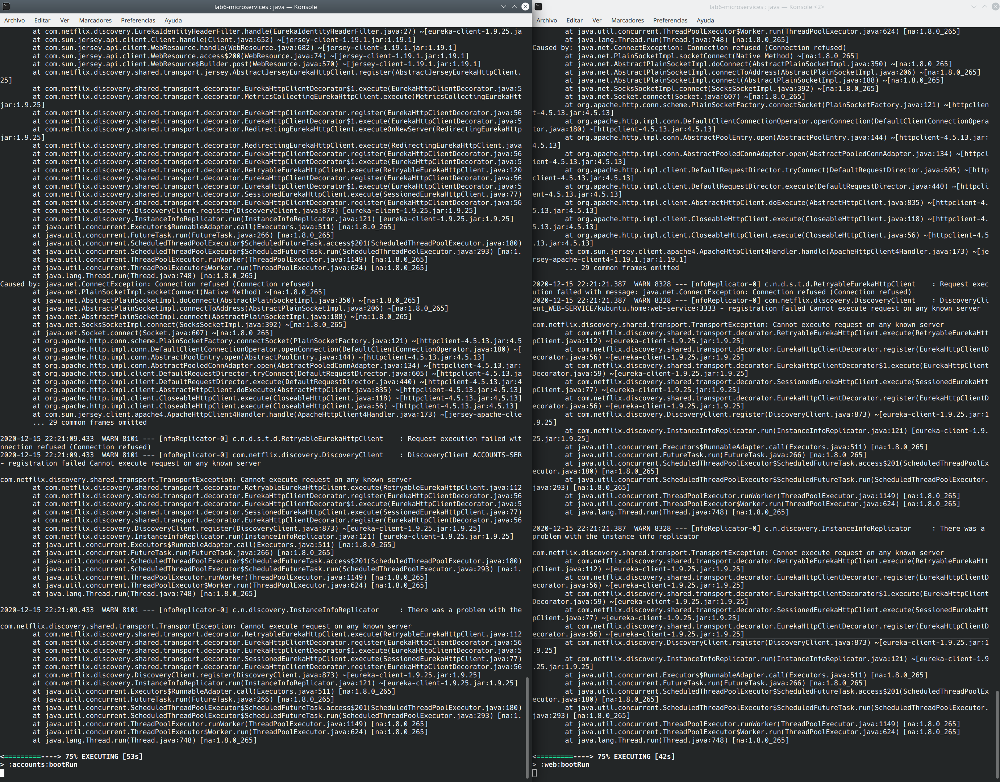
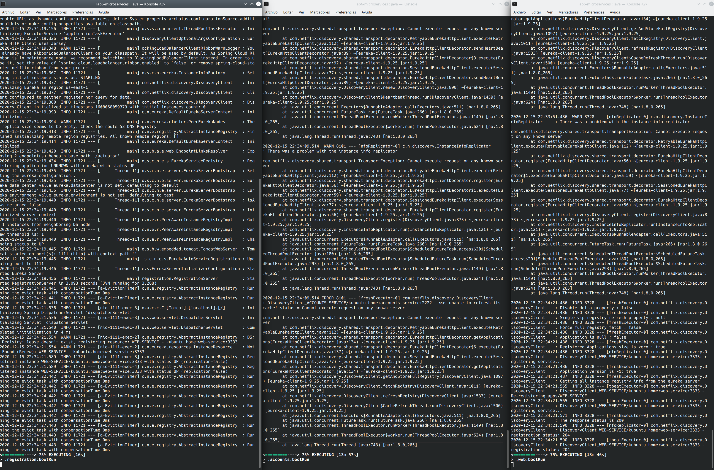
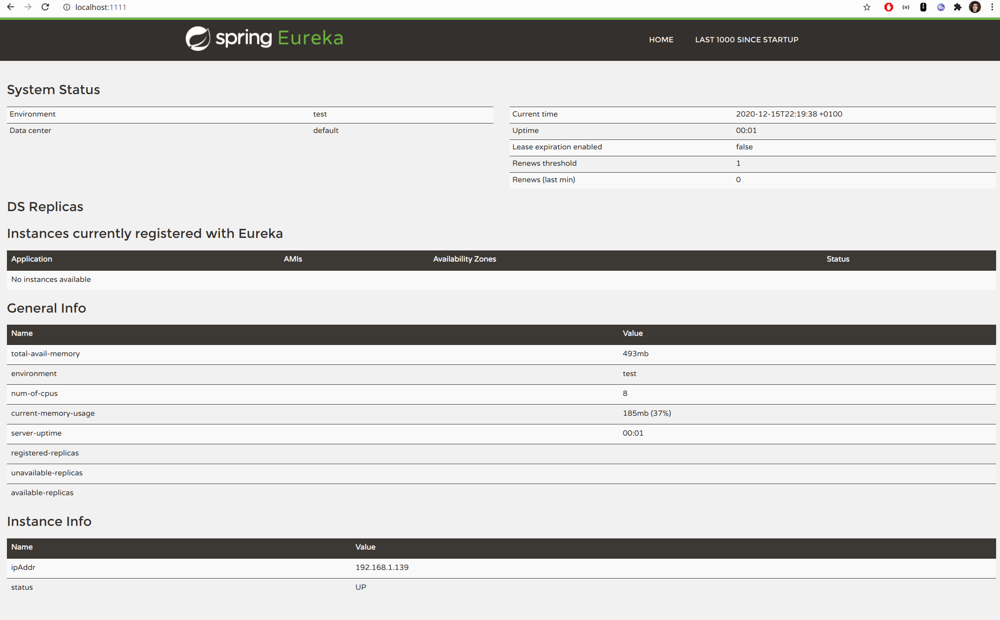
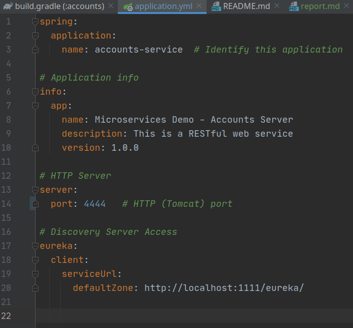
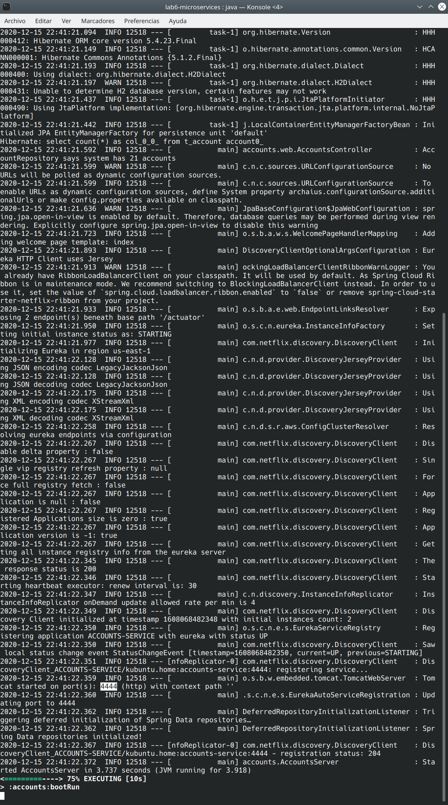
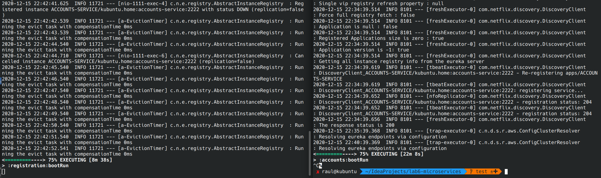
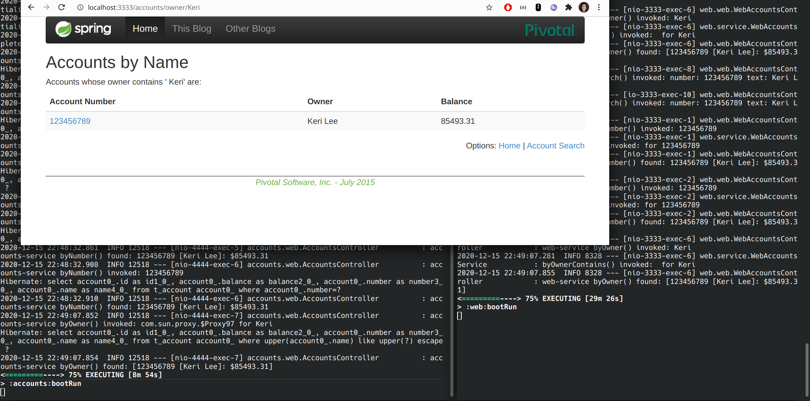
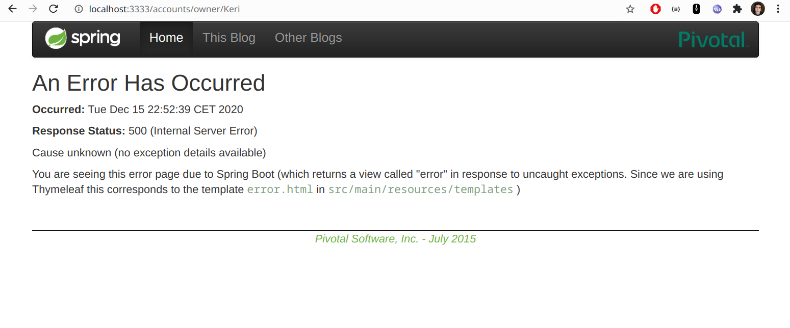
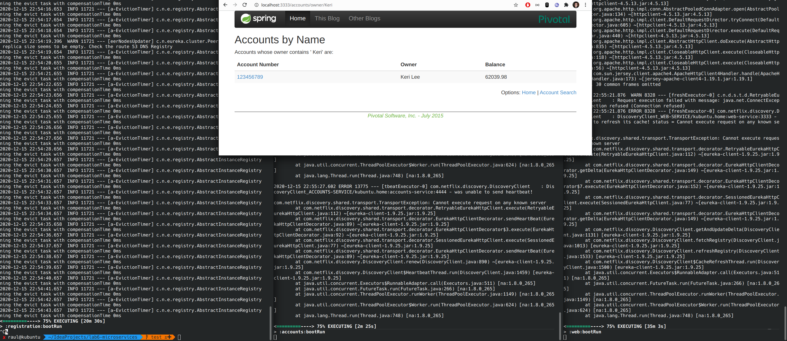

#The two microservices `accounts (2222)` and `web` are running and registered (two terminals, logs screenshots).

Left:
```
gradle :accounts:bootRun 
```

Right:
```
gradle :web:bootRun 
```



#The service registration service has these two microservices registered (a third terminal, dashboard screenshots)

Left:
```
gradle :registration:bootRun 
```

Middle:
```
gradle :accounts:bootRun 
```

Right:
```
gradle :web:bootRun 
```







#A second `accounts` microservice instance is started and will use the port 4444. This second `accounts (4444)` is also registered (a fourth terminal, log screenshots).

Changing port of microservice "accounts" in its application.yml



Executing:
```
gradle :accounts:bootRun 
```



#What happens when you kill the microservice `accounts (2222)` and do requests to `web`?  Can the web service provide information about the accounts again? Why?

SIGINT signal to accounts (2222): right terminal... Immediately, left terminal (registration) notices that accounts (2222) is down.




The web service could provide the information because accounts (4444) is registered in Eureka.




If we signal accounts (4444) and we try again... We will get an error.




However, I tried to get an error signalling Eureka but all seems right (after the signal and five minutes later). It might be because the services "accounts (4444)" and "web" knew each other and they did not need Eureka.




Note: application.yml (accounts) has been restored before committing.